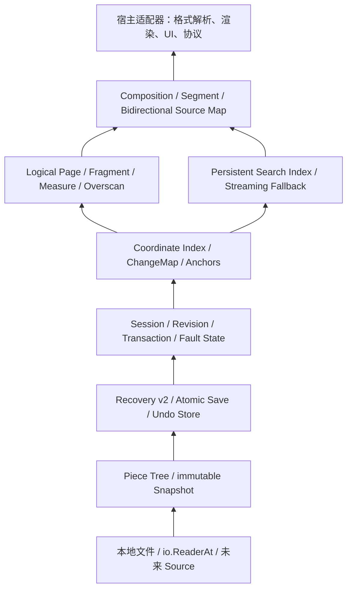

# Docengine 发展设计与完成度评估

本文记录 v0.3.0 之后 Docengine 的边界、当前完成度、目标架构和到 1.0
仍需完成的工作。百分比是按能力重要性估算的工程成熟度，不是代码量或工期承诺。

## 不可破坏的定位

Docengine 是本地 UTF-8 文档的通用编排内核。内核可以理解：

- 原始字节、UTF-8 合法性、BOM 和换行；
- byte、line、rune 等通用坐标；
- revision、不可变 Snapshot、范围替换和 ChangeSet；
- 有界逻辑页、格式无关 Fragment 和无单位抽象尺寸；
- 原始文本上的搜索、索引候选和字节范围结果。

内核不能理解 Markdown、HTML、JSON、源代码语法或任何其他文本格式，不能根据
内容猜测标题、段落、列表、语法节点或渲染方式。格式解析器、语义 Fragment
生产器、渲染器、字体测量、DOM、像素布局、命令和产品工作流都属于宿主或适配器。

“格式无关”不等于“二进制无关”：当前基础模型明确是 UTF-8 文本文档。若将来支持
任意二进制内容，应另建 Source/Store 层能力，不能悄悄弱化现有 UTF-8 不变量。

## v0.3.0 完成度

| 能力块 | 估算成熟度 | 已具备 | 主要缺口 |
| --- | ---: | --- | --- |
| Piece Tree、Snapshot、事务 | 约 90% | 磁盘 Source、结构共享、批次原子发布、快照隔离 | Piece 压缩、稳定坐标索引、系统化基准 |
| Recovery 与保存 | 约 80% | v2 原子批 journal、完整 SHA-256、CRC、尾部修复、跨平台原子替换 | 崩溃进程矩阵、journal 压缩、更多文件系统验证 |
| Session 生命周期与公共 API | 约 50% | revision、undo/redo、并发保存、只读 fault、Context 打开 | 配置化限制、事件、目录所有权、稳定错误/兼容承诺 |
| 坐标与 ChangeMap | 约 15% | byte 范围、Piece newline 汇总 | byte/line/rune 映射、跨 revision 锚点变换 |
| Page/Fragment 虚拟化 | 约 10% | Snapshot 有界 `ReadAt` 是可用地基 | Page 索引、Measure、overscan、generation 调度 |
| 持久化搜索 | 接近 0% | Snapshot 可流式读取 | 索引格式、增量发布、查询接口与校验 |
| 多源 Composition | 接近 0% | Snapshot Source 可作为未来输入 | Segment、source map、组合 revision 与变更传播 |

综合看，距离“完备、可稳定嵌入的通用文档编排内核”约完成 40%，误差约
±10%。最难的存储和原子事务地基已经存在；尚未完成的 60% 主要是围绕地基建立
稳定坐标、虚拟化、搜索、组合、生命周期和生产级验证，而不是继续堆叠编辑 API。

v0.3.0 发布套件已在 Windows 本机和 WSL 2 Debian 原生 Linux 临时目录实测：
每个 package 100% statement coverage，三轮 shuffle race 全部通过，Piece Tree、
journal decoder 和 journal state-machine fuzz 在两端各运行至少 30 秒。

## 目标分层

依赖只能向下。Search、Virtualization 和 Composition 可以使用 Snapshot、revision
和 ChangeMap，但 Store、Recovery、Save 不能反向认识这些高层模块。格式适配器永远
位于最上层。

## 坐标与变更地基

后续所有虚拟化、搜索结果和 annotation 都必须以同一组基础契约为准：

- byte offset 是规范坐标，范围统一为 `[start, end)`；
- 对外提供按 Snapshot revision 固定的 byte/line/rune 转换；
- rune 坐标只处理 Unicode code point，grapheme、显示宽度和光标视觉位置属于宿主；
- 每个提交发布不可变 `ChangeSet`，包含旧/新 revision 和顺序替换；
- `ChangeMap` 明确定义范围在插入点、删除覆盖、边界粘性和完全删除时如何变换；
- 任何缓存、索引或异步结果都携带 revision/generation，过期结果不得自动套到新正文；
- 大文件坐标查询必须有界，不能为了查一行扫描完整文档。

这层应先于虚拟化和搜索完成，否则两个高层模块都会各自发明不兼容的坐标系统。

## 按页、按 Fragment 的两级虚拟化

### 逻辑 Page

Page 是 I/O、缓存和后台调度单位，不是纸张或屏幕页面。默认由内核按目标字节数
切分，并调整到 UTF-8 和可用换行边界；空文档也有确定的起止状态。Page 至少携带：

- revision/generation、page key 和 `[start, end)`；
- 起止 line、continuation 标记和内容是否完整；
- 当前页、前向/后向读取上限及实际返回字节数；
- 可选累计 `Measure` 区间。

所有请求必须同时受最大字节数、最大页数、最大 Fragment 数和最大 Measure 限制。
输入中的负数、溢出、NaN/Inf 不应存在：尺寸定义为非负定点
`type Measure int64`，比例由宿主约定，内核只做检查过的加法和比较。

### 格式无关 Fragment

宿主可为某个 revision 注入 Fragment 序列。Fragment 只包含稳定 ID、字节范围、
Measure 和 opaque data key；内核不定义 `KindParagraph`、`Heading` 等语义枚举。
宿主必须保证范围有序、无非法重叠并属于对应 Snapshot，内核必须验证后才能发布。

Page 是可靠 fallback，Fragment 是可选增强：

- 没有 Fragment 索引时，按逻辑 Page 立即工作；
- 索引构建中可发布 completeness，但不能伪装成完整；
- 巨型 Fragment 必须拆成有界 continuation page，不能因“一个块”突破内存限制；
- Fragment 更新以新 generation 原子发布，不能原地修改正在被读取的索引。

### 抽象尺寸与 viewport

内核负责累计 Measure、按 byte/fragment/measure 查找锚点、前后 overscan、范围裁剪
和过期 generation 拒绝。宿主负责把字体或布局测量转换成自己的固定比例 Measure。
因此同一内核可服务桌面 UI、终端、打印预览或非视觉消费者，但它自身不认识像素、
DOM、滚动容器或渲染组件。

需要覆盖的极端情况包括：零尺寸 Fragment、单个超大 Fragment、Measure 累加溢出、
测量晚到、快速 revision 切换、文档头尾 overscan、空文档、全删除，以及读取过程中
Snapshot 被 Session 新 revision 替代。

## 内置持久化搜索

搜索属于通用文档能力，但不能重新依赖格式块。计划内置一个纯 Go、可选开启的
SQLite/FTS5 contentless 索引实现：

- 默认索引内核生成的固定 UTF-8 安全逻辑块，并在边界保留足够重叠；
- 可使用宿主 Fragment 作为调度提示，但磁盘 schema 不保存格式 Kind；
- 文本主体不存入索引，候选命中必须回读相同 revision 的 Snapshot 验证；
- 结果只返回 revision、`[start, end)` 和可选 source key，不生成业务 excerpt；
- literal 搜索提供精确和 Unicode 大小写策略；regex 从可证明的 trigram 候选开始，
  无可靠候选时退化为受限流式扫描；
- “单词”及语言相关分词通过 `Analyzer` 接口注入，默认索引不能假定英语或 Markdown；
- 查询必须支持 Context 取消、结果上限、扫描/候选预算和明确 completeness。

索引以 generation 目录构建，完成并 fsync 后原子发布 manifest。崩溃留下的未发布
generation 可删除重建；已发布 generation 必须带 base content hash、revision、schema
和 analyzer identity。增量更新基于 ChangeMap 扩大受影响逻辑块，并重新建立边界重叠；
无法证明增量正确时宁可重建，也不能返回静默漏检的“完整”结果。

SQLite 是内置实现，不是核心不变量。上层查询接口必须与具体数据库隔离，使未来可
替换索引后端，同时保留流式 fallback 作为正确性基准和小文档路径。

## 完备编排内核仍需具备的能力

### 生命周期与资源治理

- 配置化 undo 配额、单次插入、事务操作数、sync 周期、Page/缓存/搜索预算；
- 明确 RecoveryDir、SessionDir 和索引 generation 的创建者、所有者与清理时机；
- 后台任务调度、Context 取消、优先级、背压和关闭屏障；
- Piece、journal、undo 和索引的压缩/垃圾回收，且不破坏存活 Snapshot；
- 内存、文件句柄、磁盘临时空间和后台吞吐的可观测指标。

### 事件、锚点与通用区间层

- revision 提交、保存、恢复、fault、外部变化和索引进度事件；
- 带粘性策略的 Anchor，以及跨 ChangeMap 的批量范围变换；
- annotation/decorations 只管理 ID、范围、层和 opaque payload，不理解高亮、诊断或
  Markdown 语义；
- 事件回调不得持有 Session 内部锁，慢消费者必须可取消或丢弃过期 generation。

### 外部文件变化

- 文件 watcher 只报告候选变化，最终仍以稳定读取和内容 hash 为准；
- clean Session 可由宿主选择重载，dirty Session 默认报告冲突；
- merge、diff UI 和自动覆盖属于宿主策略，内核只提供 Snapshot 与 ChangeSet 原料；
- 记录符号链接重定向、路径删除重建、权限变化、同内容 touch 和网络文件系统行为。

### 多源 Composition

Composition 是多个不可变 Snapshot Source 的有序 Segment 集合：

- Segment 引用 source ID、source revision 和源字节范围；
- Composition Snapshot 有独立 generation 和逻辑长度；
- 双向 source map 支持组合坐标到来源及来源到全部组合位置；
- 重复引用、空 Segment、跨源边界读取和来源失效必须有确定语义；
- 编辑不会被隐式写回来源，只有宿主提供明确映射和事务时才执行。

这可以支持预览、合并视图和虚拟文档，但仍不认识任何格式。

### 生产级质量

- 明确公开错误类型、取消点、并发规则和每个 API 的资源所有权；
- 为真实超大文件建立编辑、随机读取、保存、恢复、虚拟化和搜索基准；
- 运行长时间随机编辑/保存/恢复 soak，监控内存、句柄、磁盘增长和树高度；
- 用子进程在每个 fsync/rename/journal 写入边界强制终止，验证真实崩溃恢复；
- 验证 NTFS、WSL 原生文件系统和主流 Linux 文件系统；网络盘只在明确支持后承诺；
- 提供 package 文档、可运行示例、版本升级说明和 1.0 后的格式/API 兼容策略。

## 路线图

### v0.4：Session 策略与坐标地基

配置化限制和目录生命周期；发布 ChangeSet/事件；实现 byte/line/rune 索引、Anchor 和
ChangeMap；加入 Piece/journal/undo 压缩的第一版。

### v0.5：通用虚拟化

实现逻辑 Page、FragmentProvider、Measure 累计索引、byte/fragment/measure 锚点、
overscan、巨型 Fragment continuation、generation 发布和严格预算测试。

### v0.6：持久化搜索

先实现流式 literal/regex 正确性基准，再实现 contentless trigram 索引、原子 generation、
增量脏区、Analyzer、取消、completeness 和崩溃重建。

### v0.7：区间层与多源 Composition

实现通用 annotation、双向 source map、组合 Snapshot、来源变化传播和有界跨源读取。

### v0.8–v0.9：API 与生产加固

收敛公共 facade 和错误模型，完成配置/清理/监控，建立性能基线、子进程崩溃矩阵、
长时间 soak、更多文件系统验证和迁移文档。

### v1.0 准入条件

- 公开 API、journal/index schema 和兼容策略有书面承诺；
- Windows 与 Linux 的 unit、race、coverage、fuzz、crash matrix 全绿；
- 大文件前台内存、延迟、临时磁盘和后台任务均有硬预算；
- 虚拟化和搜索在索引缺失、构建中、损坏及过期时仍保证正确 fallback；
- 没有任何核心包依赖具体文本格式、渲染器、UI 框架或产品协议。
