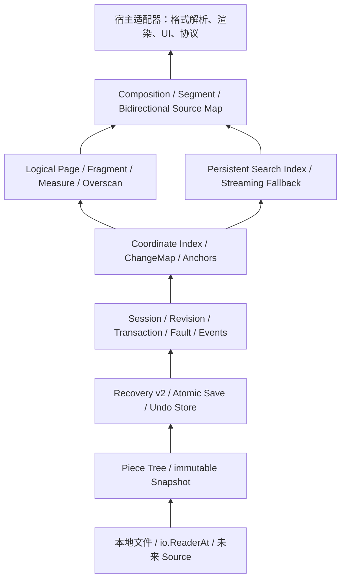

# Docengine 发展设计与完成度评估

本文记录 v0.5 完成时 Docengine 的边界、当前完成度、目标架构和到 1.0
仍需完成的工作。百分比是按能力重要性估算的工程成熟度，不是代码量或工期承诺。

## 不可破坏的定位

Docengine 是本地 UTF-8 文档的通用编排内核。内核可以理解：

- 原始字节、UTF-8 合法性、BOM 和换行；
- byte、line、rune 等通用坐标；
- revision、不可变 Snapshot、范围替换和 ChangeSet；
- 有界逻辑页、格式无关 Fragment 和无单位抽象尺寸；
- 原始文本上的搜索、索引候选和字节范围结果。

内核不能理解 Markdown、HTML、JSON、源代码语法或任何其他文本格式，不能根据
内容猜测标题、段落、列表、语法节点或渲染方式。格式解析器、语义 Fragment
生产器、渲染器、字体测量、DOM、像素布局、命令和产品工作流都属于宿主或适配器。

“格式无关”不等于“二进制无关”：当前基础模型明确是 UTF-8 文本文档。若将来支持
任意二进制内容，应另建 Source/Store 层能力，不能悄悄弱化现有 UTF-8 不变量。

## 当前完成度（v0.5 已实现）

| 能力块 | 估算成熟度 | 已具备 | 主要缺口 |
| --- | ---: | --- | --- |
| Piece Tree、Snapshot、事务 | 约 97% | 磁盘 Source、结构共享、批次原子发布、快照隔离、同源连续 Piece 手动/自动压缩、阈值退避、可观测统计、系统化基准 | 超大文件长期 soak 与跨机器趋势基线 |
| Recovery 与保存 | 约 94% | v2 原子批 journal、完整 SHA-256、CRC、尾部修复、跨平台原子替换、替换前耐久重基、journal 硬上限/自动 checkpoint、真实进程退出矩阵、系统化基准 | 真实断电注入、网络/更多本地文件系统矩阵、长期磁盘增长 soak |
| Session 生命周期与公共 API | 约 93% | revision、undo/redo、并发保存、只读 fault、配置化限制、事件/进度流、Context 取消、可超时关闭屏障、跨 generation Snapshot lease 硬预算与统计、有界 ChangeMap、持锁孤儿回收、首版压缩 | watcher、全局资源指标、稳定错误/兼容承诺 |
| 坐标与 ChangeMap | 约 95% | revision 固定索引、有界 LRU 查询缓存、Anchor/Range/opaque Annotation、线性组合/反转、可证明前缀/后缀复用、lineage、托管刷新、可取消且有工作量硬上限的批量变换 | 持久区间集合、长期超大索引 soak |
| Page/Fragment 虚拟化 | 约 88% | UTF-8 逻辑 Page、FragmentProvider、索引水位、Measure、三类锚点、overscan、continuation、generation CAS、LRU/任务硬预算 | progress 事件、自动跨 revision 刷新、长期性能基线 |
| 持久化搜索 | 接近 0% | Snapshot 可流式读取 | 索引格式、增量发布、查询接口与校验 |
| 多源 Composition | 接近 0% | Snapshot Source 可作为未来输入 | Segment、source map、组合 revision 与变更传播 |

综合看，距离“完备、可稳定嵌入的通用文档编排内核”约完成 74%，误差约
±10%。存储、原子事务、资源策略、坐标变更与通用虚拟化地基已经存在；尚未完成的
约 30% 主要是搜索、组合、watcher/后台任务治理和生产级验证，而不是继续堆叠编辑 API。

v0.3.0 发布套件已在 Windows 本机和 WSL 2 Debian 原生 Linux 临时目录实测：
每个 package 100% statement coverage，三轮 shuffle race 全部通过，Piece Tree、
journal decoder 和 journal state-machine fuzz 在两端各运行至少 30 秒。

完整 v0.4 发布套件已在 Windows 本机和 WSL 原生 Linux 目录验证：五个 package 均为
100% statement coverage，三轮 shuffle race 通过，涉及的四个 Session fuzz、一个事件
状态机 fuzz、一个 ChangeMap 历史状态机 fuzz 和三个 coordinate fuzz 在两端分别运行
10 秒并通过。

首个 v0.5.0 实现已在 Windows 本机验证，六个 Linux 测试二进制交叉编译通过。v0.5.1
正确性套件随后在 Windows 本机与 WSL 2 Debian 的原生 Linux `/tmp` 目录完整执行：
两端六个 package 均为 100% statement coverage，全仓三轮 shuffle race 通过，四个
virtual fuzz target 与新增 Session/Pager 生命周期 fuzz target 均各运行 10 秒通过。

v0.5.2 Piece Tree 维护套件在 Windows 本机与 WSL 2 Debian 原生 Linux `/tmp` 两端完成：
六个 package 继续保持 100% statement coverage，全仓三轮 shuffle race 通过，四个
Piece Tree fuzz target 各运行 30 秒；自动压缩定向边界连续运行 100 次，四类 store
benchmark 也在两端执行。

v0.5.3 Recovery/Save 套件在 Windows 本机与 WSL 2 Debian 原生 Linux `/tmp` 两端完成：
六个 package 均保持 100% statement coverage，全仓三轮 shuffle race 通过；四个
recovery fuzz、并发保存、崩溃恢复和 journal quota fuzz 各运行 30 秒。真实子进程
崩溃矩阵在每端连续通过 20 次，checkpoint/配额边界连续通过 100 次，三类持久化基准
也在两端执行。

v0.5.4 Session 生命周期套件在两端继续保持六包 100% statement coverage，并通过全仓
三轮 shuffle race。lifecycle budget、Session state、并发保存、崩溃恢复及 Session/Pager
五个 fuzz target 各运行 30 秒；核心 lease/关闭/取消竞争连续通过 100 轮，详细提交前
矩阵通过 30 轮，Snapshot lease 与 4 MiB Save 基准均在两端执行。

v0.5.5 Coordinate/ChangeMap 套件在两端继续保持六包 100% statement coverage，全仓
三轮 shuffle race 通过，三个 coordinate fuzz 各运行 30 秒；缓存/后缀/取消/最大历史
边界通过 100 轮普通重复和 10 轮 race 重复。缓存命中保持零分配；4 MiB 中部编辑增量
重建在 Windows 约 0.39–0.47 ms、Linux 约 0.323–0.339 ms，256-map 线性组合均为一次
分配。

## 目标分层

依赖只能向下。Search、Virtualization 和 Composition 可以使用 Snapshot、revision
和 ChangeMap，但 Store、Recovery、Save 不能反向认识这些高层模块。格式适配器永远
位于最上层。

## 坐标与变更地基

后续所有虚拟化、搜索结果和 annotation 都必须以同一组基础契约为准：

- byte offset 是规范坐标，范围统一为 `[start, end)`；
- 对外提供按 Snapshot revision 固定的 byte/line/rune 转换；
- rune 坐标只处理 Unicode code point，grapheme、显示宽度和光标视觉位置属于宿主；
- 每个提交发布不可变 `ChangeSet`，包含旧/新 revision 和顺序替换；
- `ChangeMap` 明确定义范围在插入点、删除覆盖、边界粘性和完全删除时如何变换；
- 任何缓存、索引或异步结果都携带 revision/generation，过期结果不得自动套到新正文；
- 大文件坐标查询必须有界，不能为了查一行扫描完整文档。

这层应先于虚拟化和搜索完成，否则两个高层模块都会各自发明不兼容的坐标系统。

当前实现已经完成 Snapshot revision 固定的流式索引、UTF-8 安全 checkpoint、
byte/line/rune 双向转换、顺序 ChangeMap、Anchor before/after 粘性、组合与反转，并让
Session 的编辑、undo、redo 返回对应映射。增量重建接收精确 ChangeMap 链：保留所有
顺序编辑之前的稳定 checkpoint 前缀，同时沿顺序 edit 推导未触碰旧/新后缀的对应边界；
扫描新 Snapshot 到第一个真正能节省解码的旧后缀 checkpoint 后，用新 seam 的
rune/line/column 状态校准并平移余下 checkpoint。这里依赖“新 Source 是该 ChangeMap
精确结果”的 API 契约，而不做第二次内容读取或格式猜测；EOF 单点没有收益时仍全量扫尾。
旧、新 Index 各自持有独立 Source lease。

每个 Index 还拥有默认 1 MiB、硬上限 256 MiB 的查询窗口 LRU，Close 负责清空，Stats
报告驻留量和命中率；并发 miss 的瞬时缓冲不计入驻留预算。Session 以有界 ring 保留跨
revision 映射，区分历史淘汰和不可观察的批次内部 revision；opaque lineage 防止外来
Index 被错误复用，托管刷新会原子取得映射链与当前 Snapshot。`ComposeAll` 将长历史从
逐段重复复制改为一次预检、一次分配，单图最多 1,048,576 个 edit；批量 Anchor/Range/
Annotation 变换最多执行 16,777,216 个 edit×anchor 步骤，并提供 Context 取消。
持久区间集合仍属于后续 v0.7，而不是坐标索引继续扩张的职责。

每次非空 Apply、Undo 和 Redo 提交现在还会发布携带同一不可变 ChangeMap 的
`SessionEvent`。消费者可用单调 sequence 续接事件；发现 `Dropped > 0` 时不能继续盲目
套用映射，必须从当前 Snapshot 重建派生状态。保存还发布带 operation ID 的开始、
有界字节进度、完成/失败事件；恢复 WAL Sync 只在失败与恢复的状态跃迁时发布，当前
不确定性同时进入 Metadata，避免事件淘汰后丢失状态。

## 按页、按 Fragment 的两级虚拟化

### 逻辑 Page

Page 是 I/O、缓存和后台调度单位，不是纸张或屏幕页面。默认由内核按目标字节数
切分，并调整到 UTF-8 和可用换行边界；空文档也有确定的起止状态。Page 至少携带：

- revision/generation、page key 和 `[start, end)`；
- 起止 line、continuation 标记和内容是否完整；
- 当前页、前向/后向读取上限及实际返回字节数；
- 可选累计 `Measure` 区间。

所有请求必须同时受最大字节数、最大页数、最大 Fragment 数和最大 Measure 限制。
输入中的负数、溢出、NaN/Inf 不应存在：尺寸定义为非负定点
`type Measure int64`，比例由宿主约定，内核只做检查过的加法和比较。

### 格式无关 Fragment

宿主可为某个 revision 注入 Fragment 序列。Fragment 只包含稳定 ID、字节范围、
Measure 和 opaque data key；内核不定义 `KindParagraph`、`Heading` 等语义枚举。
宿主必须保证范围有序、无非法重叠并属于对应 Snapshot，内核必须验证后才能发布。

Page 是可靠 fallback，Fragment 是可选增强：

- 没有 Fragment 索引时，按逻辑 Page 立即工作；
- 索引构建中可发布 completeness，但不能伪装成完整；
- 巨型 Fragment 必须拆成有界 continuation page，不能因“一个块”突破内存限制；
- Fragment 更新以新 generation 原子发布，不能原地修改正在被读取的索引。

### 抽象尺寸与 viewport

内核负责累计 Measure、按 byte/fragment/measure 查找锚点、前后 overscan、范围裁剪
和过期 generation 拒绝。宿主负责把字体或布局测量转换成自己的固定比例 Measure。
因此同一内核可服务桌面 UI、终端、打印预览或非视觉消费者，但它自身不认识像素、
DOM、滚动容器或渲染组件。

需要覆盖的极端情况包括：零尺寸 Fragment、单个超大 Fragment、Measure 累加溢出、
测量晚到、快速 revision 切换、文档头尾 overscan、空文档、全删除，以及读取过程中
Snapshot 被 Session 新 revision 替代。

v0.5 已实现上述核心契约。`document/virtual.Pager` 固定一个 immutable Source
revision；`Session.VirtualPager` 为它转移 Snapshot lease。逻辑 Page 在 target 后优先
选择 LF，并在 maximum 前强制落到 UTF-8 边界。Fragment publication 用
`BaseGeneration` 做 CAS，`IndexedThrough` 把已分析 gap 与未知后缀分开；完整扫描也可
明确保持 incomplete。Fragment 字符串会 clone，实际 key bytes、Fragment 数和单
Fragment Measure 都受硬限制。

byte、Fragment ID 和 Measure 三种窗口同时执行 byte/page/distinct-fragment/Measure
预算。巨型 Fragment 可选择 continuation Page，Measure 仍保持父 Fragment 原子区间，
不会按字节比例伪造布局。LRU 只计算驻留 payload；活跃请求的返回副本由
`MaximumTasks × Window.Bytes` 约束内核内同时构造的 Window，调用返回后由宿主持有的
副本另计入宿主预算。Provider 回调不持 Pager/Session 锁，可以读取 `Stats`，但不得同步
调用同一 Pager 的任务型 API 或 `Close`；慢结果不能覆盖新 generation；并发 `Close`
等待同一任务屏障并共享 Source release 结果。
当前剩余工作是 progress 事件、可选的跨 revision 自动刷新和长期性能/内存基线，不影响
无 Fragment 时的逻辑 Page fallback。

## 内置持久化搜索

搜索属于通用文档能力，但不能重新依赖格式块。计划内置一个纯 Go、可选开启的
SQLite/FTS5 contentless 索引实现：

- 默认索引内核生成的固定 UTF-8 安全逻辑块，并在边界保留足够重叠；
- 可使用宿主 Fragment 作为调度提示，但磁盘 schema 不保存格式 Kind；
- 文本主体不存入索引，候选命中必须回读相同 revision 的 Snapshot 验证；
- 结果只返回 revision、`[start, end)` 和可选 source key，不生成业务 excerpt；
- literal 搜索提供精确和 Unicode 大小写策略；regex 从可证明的 trigram 候选开始，
  无可靠候选时退化为受限流式扫描；
- “单词”及语言相关分词通过 `Analyzer` 接口注入，默认索引不能假定英语或 Markdown；
- 查询必须支持 Context 取消、结果上限、扫描/候选预算和明确 completeness。

索引以 generation 目录构建，完成并 fsync 后原子发布 manifest。崩溃留下的未发布
generation 可删除重建；已发布 generation 必须带 base content hash、revision、schema
和 analyzer identity。增量更新基于 ChangeMap 扩大受影响逻辑块，并重新建立边界重叠；
无法证明增量正确时宁可重建，也不能返回静默漏检的“完整”结果。

SQLite 是内置实现，不是核心不变量。上层查询接口必须与具体数据库隔离，使未来可
替换索引后端，同时保留流式 fallback 作为正确性基准和小文档路径。

## 完备编排内核仍需具备的能力

### 生命周期与资源治理

- 配置化 undo/journal 配额、单次插入、事务操作数、Snapshot lease、sync 周期、
  Page/缓存预算；搜索预算留待搜索模块；
- 明确 RecoveryDir、SessionDir 和索引 generation 的创建者、所有者与清理时机；
- Session 的自动 checkpoint 已纳入生命周期 Context 与同一关闭屏障；排队保存会在关闭
  时立即退出，宿主 Save/Commit/Undo/Redo 有 Context 版本，`CloseContext` 超时后清理
  继续。未来搜索/Page 跨模块调度仍需统一优先级和背压；
- Piece/undo 与保存检查点 journal 压缩首版已具备；journal 已有默认 4 GiB 硬上限和
  显式启用的自动 checkpoint 阈值，后续仍需索引 GC，且始终不能破坏存活 Snapshot；
- `LifecycleStats` 已报告跨 generation host lease、保存排队/执行与关闭状态；
  后续仍需聚合内存、实际文件句柄、磁盘临时空间和后台吞吐指标。

### 事件、锚点与通用区间层

v0.4 事件与通用区间阶段已经完成：

- 有界历史和每订阅者有界队列，慢消费者不阻塞 Session 写锁；
- `AfterSequence` 续接、`FutureOnly`、历史缺口及实时溢出的精确 `Dropped`；
- 打开、恢复、Apply/Undo/Redo 提交、保存生命周期、恢复 WAL Sync 跃迁和最终关闭事件；
  失败事务与 no-op 不发布变更事件；
- 最终关闭事件在队列溢出时仍可达，所有并发 `Close` 调用共享同一个资源退役屏障；
- 退订、发布与 Session 关闭可并发，通道不会发生重复关闭或 send-on-closed；
- 保存事件区分提交前失败、已提交但目录耐久性未知、提交后永久 fault，并提供有界进度；
- 跨平台 marker 文件锁保护 live owned Session；自动和显式回收只删除合法、未持锁且
  没有未知内容的崩溃遗留目录；
- 基于历史窗口批量变换 Anchor、AnchoredRange 与 opaque `Annotation[T]`，错误时不返回
  部分结果；
- Piece 只合并同 Source 连续范围，undo 原子切换到只含存活引用的新 store，journal 仅
  通过显式保存检查点重基，均不破坏已发出的 Snapshot。

后续高层仍需完成：

- watcher 候选变化、索引/虚拟化进度，以及后台任务 generation/completeness 契约；
- 稳定错误载荷与跨 1.0 的事件兼容承诺；
- 持久 annotation/decorations 集合只管理 ID、范围、层和 opaque payload，不理解高亮、
  诊断或 Markdown 语义；
- 若将来增加回调适配器，回调不得持有 Session 内部锁；当前仅使用不会等待消费者的
  有界通道，过期 generation 仍必须由消费者拒绝。

### 外部文件变化

- 文件 watcher 只报告候选变化，最终仍以稳定读取和内容 hash 为准；
- clean Session 可由宿主选择重载，dirty Session 默认报告冲突；
- merge、diff UI 和自动覆盖属于宿主策略，内核只提供 Snapshot 与 ChangeSet 原料；
- 记录符号链接重定向、路径删除重建、权限变化、同内容 touch 和网络文件系统行为。

### 多源 Composition

Composition 是多个不可变 Snapshot Source 的有序 Segment 集合：

- Segment 引用 source ID、source revision 和源字节范围；
- Composition Snapshot 有独立 generation 和逻辑长度；
- 双向 source map 支持组合坐标到来源及来源到全部组合位置；
- 重复引用、空 Segment、跨源边界读取和来源失效必须有确定语义；
- 编辑不会被隐式写回来源，只有宿主提供明确映射和事务时才执行。

这可以支持预览、合并视图和虚拟文档，但仍不认识任何格式。

### 生产级质量

- 明确公开错误类型、取消点、并发规则和每个 API 的资源所有权；
- 为真实超大文件建立编辑、随机读取、保存、恢复、虚拟化和搜索基准；
- 运行长时间随机编辑/保存/恢复 soak，监控内存、句柄、磁盘增长和树高度；
- 已用真实子进程覆盖 WAL append 后、替换前、替换后及带并发编辑的替换两侧退出；
  后续继续扩展到可控断电、每个 fsync/rename 系统调用和更多文件系统；
- 验证 NTFS、WSL 原生文件系统和主流 Linux 文件系统；网络盘只在明确支持后承诺；
- 提供 package 文档、可运行示例、版本升级说明和 1.0 后的格式/API 兼容策略。

## 路线图

### v0.4：Session 策略与坐标地基

配置化限制和目录生命周期；发布 ChangeSet/事件；实现 byte/line/rune 索引、Anchor 和
ChangeMap；加入 Piece/journal/undo 压缩的第一版。

状态：实现完成。已交付坐标索引、Anchor/Range/opaque Annotation、ChangeMap、Session
返回映射、配置化限制、sync 周期、undo 临时文件隔离、shared/owned 目录清理、持锁
崩溃孤儿回收、可续接 ChangeSet/保存进度/WAL 耐久性事件、并发关闭屏障、安全 checkpoint
前缀增量复用、lineage 校验、有界跨 revision 映射保留、批量变换，以及不破坏 Snapshot
的 Piece/undo/保存检查点 journal 压缩首版。

### v0.5：通用虚拟化

实现逻辑 Page、FragmentProvider、Measure 累计索引、byte/fragment/measure 锚点、
overscan、巨型 Fragment continuation、generation 发布和严格预算测试。

状态：实现完成。已交付 UTF-8 安全 Page 分区、空文档确定页、分析水位与 gap fallback、
opaque key 克隆和预算、Measure 溢出检查、三类窗口和 affinity、非对称 overscan、
continuation 定位、generation CAS、Provider 任务背压、有界 LRU、并发关闭屏障、
Session Snapshot 生命周期集成、100% statement coverage、四个 fuzz target 和基准。

### v0.5.x：停止向上堆叠，横向补齐现有模块

在进入 v0.6 搜索前，按依赖从底向上逐个关闭当前模块的主要缺口，每个模块单独测试、
双平台验证、提交并发布小版本。`v0.5.2` 首先补齐 Piece Tree：默认 4,096 Piece 自动
压缩阈值、无收益扫描退避、可配置关闭、原子 `Tree.Stats`、旧 Snapshot 保留，以及顺序
追加、随机替换、碎片读取和压缩的系统化 benchmark。新的自动压缩 stateful fuzz 用
内存 byte slice 参考模型验证随机阈值、编辑、旧 Snapshot 和统计不变量。

`v0.5.3` 补齐 Recovery/Save 的主要缺口：默认 4 GiB journal 硬上限在写入前按 v2
编码精确检查；`AutoCheckpointJournalBytes` 只有显式设置才授权后台保存，并在失败后
退避一个完整阈值；`RecoveryStats` 暴露物理增长和调度状态。并发保存不再在替换后临时
重写 journal，而是在最终身份检查的短写屏障内，先为新基础预建、Sync journal 及其父
目录，再原子替换。重开会从同路径候选中只选择唯一匹配完整基础 fingerprint 的 journal，
并隔离已证明退役的候选。真实子进程测试覆盖 WAL append 后、替换前和替换后退出，
其中包含保存期间到达新编辑的两侧状态；新增 quota stateful fuzz 与 Recovery/Save
benchmark 还发现并修复了 Replay 为每个 batch 重复分配 64 KiB CRC 缓冲的问题。

`v0.5.4` 补齐 Session 生命周期的主要资源边界：宿主持有的 `SnapshotLease`、coordinate
`Index` 与 virtual `Pager` 在当前和所有退役 generation 间共享默认 1,024 个 permit，
精确饱和时不取得底层引用；内部保存 Snapshot 不占宿主预算，避免宿主泄漏反过来阻止
持久化。`LifecycleStats` 报告 active/peak lease、等待/执行中的保存、自动 checkpoint
与 closing/closed。Save/Commit/Undo/Redo 增加 Context 版本；取消在原子替换之前保持
磁盘、revision 与历史不变，替换后则以已提交事实为准。`CloseContext` 允许调用方超时，
但唯一资源屏障继续后台清理；Close 会取消自动 checkpoint 并唤醒所有排队保存，同时
保持已经开始的宿主 Save 由其调用 Context 决定。状态机 fuzz 和逐检查点测试覆盖这些
组合，Snapshot permit 热路径另有基准约束。

`v0.5.5` 补齐 Coordinate/ChangeMap：Index 自有有界查询窗口 LRU，顺序 ChangeMap
证明并校准的 checkpoint 后缀复用，长历史一次分配的 `ComposeAll`，以及 edit 数和
批量变换工作量硬上限。UTF-8/换行/列状态、无收益 EOF、净零编辑 seam 去重、缓存精确
淘汰、并发查询和 1,048,576-edit 压力边界均进入测试；增量/全量等价 fuzz 直接覆盖新的
后缀路径。

后续小版本继续处理事件/压缩和 Virtual 的刷新/进度/性能缺口。
这一维护线不实现搜索、持久区间集合或 Composition。所有模块结束后，再单独修复当前
Windows CI 的 journal durability 事件/句柄清理失败，并用独立小版本发布。

### v0.6：持久化搜索

先实现流式 literal/regex 正确性基准，再实现 contentless trigram 索引、原子 generation、
增量脏区、Analyzer、取消、completeness 和崩溃重建。

### v0.7：持久区间集合与多源 Composition

在 v0.4 的无状态通用 annotation 变换上实现持久区间集合、双向 source map、组合
Snapshot、来源变化传播和有界跨源读取。

### v0.8–v0.9：API 与生产加固

收敛公共 facade 和错误模型，完成配置/清理/监控，扩展性能基线与崩溃矩阵，执行
长时间 soak、更多文件系统验证和迁移文档。

### v1.0 准入条件

- 公开 API、journal/index schema 和兼容策略有书面承诺；
- Windows 与 Linux 的 unit、race、coverage、fuzz、crash matrix 全绿；
- 大文件前台内存、延迟、临时磁盘和后台任务均有硬预算；
- 虚拟化和搜索在索引缺失、构建中、损坏及过期时仍保证正确 fallback；
- 没有任何核心包依赖具体文本格式、渲染器、UI 框架或产品协议。
